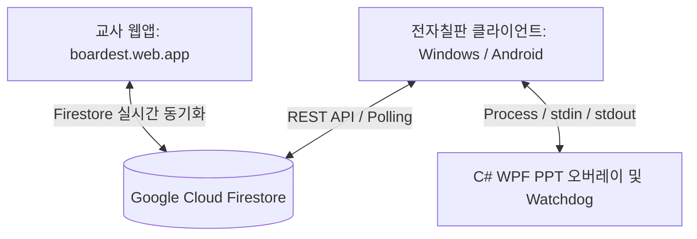

# Boardest Development Guide (중요 개발 방식 정리)

이 문서는 Boardest 프로젝트의 핵심 설계 철학, 주요 기술 스택 구현 상세(Flutter, Firebase REST API, C# COM Interop), 그리고 데이터베이스 사용량 할당(Quota) 초과 시 타 플랫폼(Supabase, PocketBase 등)으로 이전할 수 있는 마이그레이션 방안을 정리한 개발 가이드라인입니다.

---

## 1. 아키텍처 및 기술 스택 개요

Boardest는 **전자칠판용 클라이언트(Flutter 데스크톱/안드로이드)**와 **교사용 컨트롤러(Firebase 웹앱)**가 Firestore를 통해 실시간으로 양방향 동기화하는 구조로 설계되어 있습니다.



### 핵심 구성 요소
1. **전자칠판 클라이언트 (Flutter)**: 교실 화면에 설치되어 급식표, 시간표, 판서(IWB), PPT 오버레이 등을 실행합니다.
2. **C# 오버레이 모듈 (Windows 전용)**:
   - `boardest_ppt_overlay.cs`: PowerPoint COM API를 동적으로 Late-Binding하여 PPT 슬라이드쇼 위에 반투명 WPF 펜 판서 레이어를 올립니다.
   - `boardest_ppt_helper.cs`: PPT 슬라이드 제어를 위한 다기능 백그라운드 헬퍼 프로그램입니다.
   - `watchdog.cs`: Flutter 메인 프로세스가 강제 종료될 때, PowerPoint 및 WPF 오버레이 프로세스가 메모리에 좀비로 남지 않도록 동반 종료시킵니다.
3. **교사용 컨트롤 플랫폼 (Web)**:
   - `firebase_web/index.html`: 급식 호출(Class Call), 학급별 메시지 공지, 특정 학생 개별 호출 등을 전송할 수 있는 컨트롤 모바일 친화 웹앱입니다.

---

## 2. 데이터베이스 연동 및 REST API 구조

클라이언트가 비대해지고 네이티브 C++ 의존성 등이 엉키는 것을 막기 위해, Flutter 클라이언트는 두꺼운 Firebase SDK 대신 **Google Firestore REST API**를 직접 호출하도록 구현되어 있습니다.

### A. 사용자 인증 방식 및 문서 ID 매핑
- **비밀번호 인증**: 이메일 주소(`email`)를 문서 ID로 변환(URL Encoding 적용)하여 `/users/{encodedEmail}` 경로로 직접 문서 생성을 요청(`PATCH`)하거나 조회(`GET`)합니다.
- **문서 ID 형식**:
  - 교실(Class) 계정: `Class.{Grade}{Class}@{School}.{Region}.nopw.bst`
  - 이 형식은 Firestore 문서 ID에서 허용하는 인코딩 방식으로 변환되어 들어갑니다 (예: `Class.205%40%EC%96%91%EB%8F%99%EC%A4%91%ED%95%99%EA%B5%90.%EC%84%9C%EC%A7%80%EC%97%AD.nopw.bst`).
- **암호화**: 비밀번호는 클라이언트 단에서 `SHA-256` 해싱 과정을 거친 후 Firestore 문서의 `passwordHash` 필드에 보관 및 대조됩니다.

### B. 급식 호출 (`eat_calls`) 동기화 스키마
전자칠판 클라이언트가 실행되면 주기적으로 `/eat_calls` 컬렉션에 자신의 온라인 여부를 전송합니다.

- **문서 ID 구성**: `${connectionName}_${cafeteriaNum}_${grade}_${classNum}` (예: `My_1_2_5`)
- **주요 필드**:
  ```json
  {
    "place": "서울",
    "schoolName": "양동중학교",
    "schoolCode": "My",
    "cafeteriaNum": "1",
    "grade": 2,
    "classNum": 5,
    "classNickname": "2학년 5반",
    "called": false,
    "lastActive": "2026-06-02T16:33:35.000Z",
    "classOrder": "asc"
  }
  ```
- **연동 주기**:
  - **Presence 갱신**: 클라이언트는 매 60초마다 `lastActive` 시간을 현재 서버 기준 UTC 타임스탬프로 업데이트하여 자신이 온라인 상태임을 알립니다.
  - **호출 상태 감시 (Polling)**: 클라이언트는 매 3초마다 GET 요청으로 `called` 필드를 검사하여, 교사 웹앱이 `called: true`로 값을 바꾸면 화면에 급식 호출 레이어를 띄웁니다.

---

## 3. C# PowerPoint 오버레이 연동 메커니즘

Windows 환경에서 PPT가 실행되면 Flutter는 백그라운드 프로세스로 `boardest_ppt_overlay.exe`를 구동합니다.

### Dynamic COM Late-Binding
WPF 오버레이는 Interop 어셈블리 없이 `dynamic` 바인딩을 통해 PPT의 `ProgID`인 `PowerPoint.Application`에 접속합니다:
```csharp
Type pptType = Type.GetTypeFromProgID("PowerPoint.Application");
_pptApp = Activator.CreateInstance(pptType);
```

### 슬라이드 내 애니메이션 빌드 제어
일반 슬라이드쇼는 `CurrentShowPosition`의 페이지만 비교하면 되지만, 슬라이드 내에 애니메이션 효과(클릭 시 나타나는 텍스트 등)가 있는 경우 페이지는 그대로 유지된 채 애니메이션 인덱스만 올라갑니다.
- **API 메서드**:
  - `_slideShowView.GetClickIndex()`: 현재 슬라이드에서 진행된 클릭 횟수 (1-based)
  - `_slideShowView.GetClickCount()`: 현재 슬라이드의 총 애니메이션 클릭 수
- **Next 동작 규칙**:
  - `currentClick < totalClicks` 일 때는 슬라이드를 넘기지 않고 `Next()` 애니메이션 효과를 순차 적용합니다.
  - `currentClick >= totalClicks` 상태에서 Next를 누를 때 비로소 다음 슬라이드로 넘어갑니다.
  - 만약 마지막 슬라이드(`pageBefore == totalSlides`)이고 애니메이션이 모두 끝났다면 `LAST_SLIDE_NEXT` 스트림을 stdout으로 송출하여 다음 PPT로 자동 전환하게 유도한 뒤 오버레이 프로세스를 스스로 닫습니다.

---

## 4. 안드로이드 빌드 및 영구 설치 가이드 (재부팅 시 삭제 방지)

개발 단계에서 `flutter run` 명령을 사용해 앱을 배포하면 임시 실행용 **Debug APK (Volatile)** 가 기기의 휘발성 영역에 설치될 수 있습니다. 이 경우, 디바이스를 재부팅할 때 OS 및 백신/정리 툴이 이를 찌꺼기 파일로 판단하여 삭제해버리는 현상이 발생합니다.

이를 해결하기 위해서는 서명된 **Release APK**를 정식 빌드하고 설치해야 합니다.

### 영구 설치 프로세스
1. **프로젝트 루트에서 릴리즈 빌드 실행**:
   ```bash
   flutter build apk --release
   ```
2. **생성된 릴리즈 빌드 파일 위치 확인**:
   `build/app/outputs/flutter-apk/app-release.apk`
3. **ADB 명령어로 정식 설치**:
   ```bash
   adb install -r build/app/outputs/flutter-apk/app-release.apk
   ```
   `-r` 옵션은 기존 디버그 서명 또는 데이터를 교체하며 영구 시스템 파티션 레지스트리에 앱을 등록합니다.

---

## 5. Firebase 무료 할당량(Quota) 초과 시 대체 플랫폼 이전 방안

Firebase Spark(무료) 요금제는 **Firestore 일일 읽기 5만 회, 쓰기 2만 회**의 제한이 있습니다. 본 앱처럼 3초마다 Polling을 하는 구조의 경우, 다수의 학급이 동시 사용하면 할당량이 금방 소진됩니다. 사용량이 폭증하여 할당량 에러(HTTP 403, 429)가 발생할 경우 아래의 대체재로 신속하게 마이그레이션할 수 있습니다.

### 대체 데이터베이스 후보군
1. **Supabase (추천)**:
   - PostgreSQL 기반의 오픈소스 Firebase 대체제.
   - 무료 등급에서 일일 API 호출 무제한, 실시간 웹소켓(Realtime PostgREST)을 기본 제공하여 Polling 비용을 원천 차단 가능.
2. **PocketBase**:
   - 단일 Go 파일로 구동되는 초경량 SQLite 기반 오픈소스 백엔드.
   - 월 2~3달러 수준의 저가 VPS(Cafe24, 가비아 등)에 올려 독립 구동하여 트래픽 제한 없이 완벽한 자급자족 환경 구축 가능.

### 데이터베이스 마이그레이션 3단계 실행 가이드

#### 1단계: API 요청 주소 및 Key 변경 (코드 레벨)
- **Flutter 클라이언트**: `lib/services/auth_service.dart` 및 `lib/services/meal_call_service.dart` 내의 API endpoint 문자열 수정.
  ```dart
  // 기존 Firebase REST URL
  // static const String _firestoreBase = 'https://firestore.googleapis.com/v1/projects/...';
  
  // 마이그레이션 대상 URL (예: Supabase REST API)
  static const String _supabaseBase = 'https://[YOUR-PROJECT-ID].supabase.co/rest/v1';
  static const String _supabaseKey = 'YOUR_ANON_KEY';
  ```
  REST 구조가 바뀔 경우 `http.patch`와 `http.get` 바디 매핑 로직을 해당 데이터베이스의 포맷에 맞게 수정합니다 (Firebase의 `{ "fields": { "called": { "booleanValue": true } } }` 번잡한 포맷에서 일반 JSON 구조로 변경 가능하므로 코드가 간결해집니다).

- **교사용 Web App**: `firebase_web/index.html`에서 Firebase 초기화 코드를 제거하고, 선택한 대체 데이터베이스의 CDN SDK 링크 또는 REST API 호출 코드로 교체합니다.
  ```html
  <!-- Supabase CDN 예시 -->
  <script src="https://cdn.jsdelivr.net/npm/@supabase/supabase-js@2"></script>
  <script>
    const supabase = supabase.createClient('https://[PROJECT-ID].supabase.co', 'ANON_KEY');
    // Realtime 구독을 활용해 Polling을 없애고 즉시 동기화
  </script>
  ```

#### 2단계: 테이블/컬렉션 스키마 매핑
대체 데이터베이스에 아래의 테이블을 생성합니다.
- `users` 테이블: `id` (UID 또는 Email), `teacher_name`, `region`, `school`, `email`, `password_hash`, `created_at`
- `eat_calls` 테이블: `id` (Primary Key), `place`, `school_name`, `school_code`, `cafeteria_num`, `grade`, `class_num`, `class_nickname`, `called`, `last_active`, `class_order`, `message`, `message_from`

#### 3단계: 호스팅 서버 배포
- Firebase Hosting 대신 **Vercel**, **Netlify**, 또는 **GitHub Pages** 무료 호스팅을 사용하여 웹앱 정적 파일(`firebase_web/`)을 배포하면 완전히 독립적인 웹앱으로 복구가 완료됩니다.
